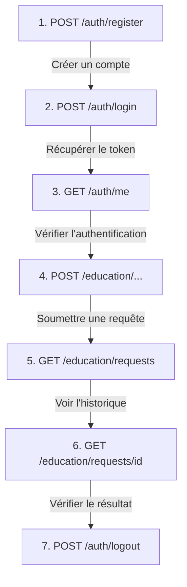

# Education SaaS API - Plateforme Éducative IA

<p align="center">
 
 
 
 
</p>

## Table des Matières

- [Description](#-description)
- [Fonctionnalités](#-fonctionnalités)
- [Architecture](#-architecture)
- [Prérequis](#-prérequis)
- [Installation](#-installation)
- [Configuration](#-configuration)
- [Utilisation de l'API](#-utilisation-de-lapi)
- [Tests Postman](#-tests-postman---guide-complet)
- [Tests Unitaires](#-tests-unitaires)
- [Contribution](#-contribution)

---

## Description

**Education SaaS API** est une API RESTful construite avec Laravel 11 qui utilise l'intelligence artificielle (OpenAI GPT-4) pour générer du contenu pédagogique personnalisé. Cette plateforme permet aux enseignants et étudiants de :

- Obtenir des explications de concepts adaptées au niveau scolaire
- Générer des exercices personnalisés
- Corriger des travaux d'étudiants avec feedback détaillé
- Créer des résumés de cours
- Générer des quiz interactifs

---

## Fonctionnalités

| Fonctionnalité | Description |
|----------------|-------------|
| **Authentification** | Inscription, connexion, déconnexion avec tokens Sanctum |
| **Explication de Concepts** | Génération d'explications pédagogiques adaptées au niveau |
| **Génération d'Exercices** | Création d'exercices personnalisés par matière et difficulté |
| **Correction d'Exercices** | Analyse et correction automatique avec feedback |
| **Résumés de Cours** | Synthèse automatique de contenus pédagogiques |
| **Génération de Quiz** | Création de questionnaires (QCM, questions ouvertes) |
| **Historique** | Consultation de l'historique des requêtes |

---

## Architecture

```
app/
├── Enums/ # Énumérations
│ ├── EducationRequestStatus.php # Statuts: pending, processing, completed, failed
│ ├── EducationRequestType.php # Types de requêtes éducatives
│ └── SchoolLevel.php # Niveaux scolaires
├── Exceptions/
│ └── OpenAIException.php # Gestion des erreurs OpenAI
├── Http/
│ ├── Controllers/
│ │ ├── Auth/ # Contrôleurs d'authentification
│ │ └── Education/ # Contrôleurs éducatifs
│ ├── Middleware/
│ │ └── ForceJsonResponse.php # Force les réponses JSON
│ ├── Requests/ # Validation des requêtes
│ └── Resources/ # Transformation des données
├── Jobs/OpenAI/ # Jobs asynchrones
├── Models/ # Modèles Eloquent
├── Policies/ # Politiques d'autorisation
├── Providers/ # Fournisseurs de services
└── Services/OpenAI/ # Services d'intégration OpenAI
```

---

## Prérequis

- **PHP** >= 8.2
- **Composer** >= 2.0
- **MySQL** >= 8.0
- **Node.js** >= 18 (optionnel, pour le frontend)
- **Clé API OpenAI** (GPT-4)

---

## Installation

### 1. Cloner le projet

```bash
git clone <repository-url>
cd TECHNICAL_TEST
```

### 2. Installer les dépendances PHP

```bash
composer install
```

### 3. Configurer l'environnement

```bash
cp .env.example .env
php artisan key:generate
```

### 4. Configurer la base de données

Éditez le fichier `.env` :

```env
DB_CONNECTION=mysql
DB_HOST=127.0.0.1
DB_PORT=3306
DB_DATABASE=education_saas
DB_USERNAME=root
DB_PASSWORD=your_password
```

### 5. Configurer OpenAI

```env
OPENAI_API_KEY=sk-your-openai-api-key-here
```

### 6. Exécuter les migrations

```bash
php artisan migrate
```

### 7. Lancer le serveur

```bash
php artisan serve
```

L'API est maintenant accessible sur `http://localhost:8000`

### 8. Lancer le worker de queue (pour le traitement asynchrone)

```bash
php artisan queue:work
```

---

## Configuration

### Variables d'environnement importantes

| Variable | Description | Exemple |
|----------|-------------|---------|
| `OPENAI_API_KEY` | Clé API OpenAI | `sk-...` |
| `DB_DATABASE` | Nom de la base de données | `education_saas` |
| `QUEUE_CONNECTION` | Driver de queue | `database` |

### Niveaux scolaires disponibles

| Valeur | Label | Description |
|--------|-------|-------------|
| `primary` | Primaire | Niveau élémentaire (6-11 ans) |
| `middle_school` | Collège | Niveau collège (11-15 ans) |
| `high_school` | Lycée | Niveau lycée (15-18 ans) |
| `university` | Université | Niveau universitaire (18+ ans) |

---

## Utilisation de l'API

### URL de base

```
http://localhost:8000/api
```

### Headers requis

```http
Content-Type: application/json
Accept: application/json
Authorization: Bearer {token} # Pour les routes protégées
```

### Format de réponse standard

**Succès :**
```json
{
 "success": true,
 "message": "Message descriptif",
 "data": { ... }
}
```

**Erreur :**
```json
{
 "success": false,
 "message": "Description de l'erreur",
 "errors": { ... }
}
```

---

## Tests Postman - Guide Complet

### Configuration initiale de Postman

1. **Créer une nouvelle Collection** : "Education SaaS API"
2. **Créer un environnement** avec ces variables :
 - `base_url` : `http://localhost:8000/api`
 - `token` : (sera rempli après la connexion)

3. **Headers par défaut** (à configurer dans la collection) :
 - `Content-Type` : `application/json`
 - `Accept` : `application/json`

---

## 1. INSCRIPTION (Register)

**Objectif** : Créer un nouveau compte utilisateur

| Propriété | Valeur |
|-----------|--------|
| **Méthode** | `POST` |
| **URL** | `{{base_url}}/auth/register` |
| **Auth** | Aucune (route publique) |

**Body (raw JSON)** :
```json
{
 "name": "Jean Dupont",
 "email": "jean.dupont@example.com",
 "password": "MonMotDePasse123!",
 "password_confirmation": "MonMotDePasse123!"
}
```

**Réponse attendue (201 Created)** :
```json
{
 "success": true,
 "message": "Inscription réussie. Veuillez vous connecter.",
 "data": {
 "user": {
 "id": 1,
 "name": "Jean Dupont",
 "email": "jean.dupont@example.com",
 "created_at": "2026-01-22T10:00:00.000000Z"
 }
 }
}
```

**Explication des champs** :
| Champ | Type | Obligatoire | Description |
|-------|------|-------------|-------------|
| `name` | string | Oui | Nom complet de l'utilisateur (max 255 caractères) |
| `email` | string | Oui | Email unique (format email valide) |
| `password` | string | Oui | Mot de passe (min 8 caractères) |
| `password_confirmation` | string | Oui | Doit correspondre exactement au mot de passe |

> **Note importante** : L'inscription ne renvoie PAS de token. Vous devez vous connecter pour obtenir un token.

---

## 2. CONNEXION (Login)

**Objectif** : Authentifier un utilisateur et obtenir un token d'accès

| Propriété | Valeur |
|-----------|--------|
| **Méthode** | `POST` |
| **URL** | `{{base_url}}/auth/login` |
| **Auth** | Aucune (route publique) |

**Body (raw JSON)** :
```json
{
 "email": "jean.dupont@example.com",
 "password": "MonMotDePasse123!"
}
```

**Réponse attendue (200 OK)** :
```json
{
 "success": true,
 "message": "Connexion réussie",
 "data": {
 "user": {
 "id": 1,
 "name": "Jean Dupont",
 "email": "jean.dupont@example.com"
 },
 "token": "1|abcdef123456789..."
 }
}
```

**Explication** :
- Le token retourné est un **Bearer Token** Laravel Sanctum
- **Copiez ce token** et sauvegardez-le dans la variable `{{token}}` de votre environnement Postman
- Ce token sera utilisé pour toutes les requêtes authentifiées

**Script de test Postman** (onglet "Tests") :
```javascript
var jsonData = pm.response.json();
if (jsonData.data && jsonData.data.token) {
 pm.environment.set("token", jsonData.data.token);
 console.log("Token sauvegardé automatiquement!");
}
```

---

## 3. PROFIL UTILISATEUR (Me)

**Objectif** : Récupérer les informations de l'utilisateur connecté

| Propriété | Valeur |
|-----------|--------|
| **Méthode** | `GET` |
| **URL** | `{{base_url}}/auth/me` |
| **Auth** | Bearer Token `{{token}}` |

**Configuration dans Postman** :
- Onglet "Authorization"
- Type : "Bearer Token"
- Token : `{{token}}`

**Réponse attendue (200 OK)** :
```json
{
 "success": true,
 "message": "Profil récupéré avec succès",
 "data": {
 "user": {
 "id": 1,
 "name": "Jean Dupont",
 "email": "jean.dupont@example.com",
 "created_at": "2026-01-22T10:00:00.000000Z"
 }
 }
}
```

---

## 4. DÉCONNEXION (Logout)

**Objectif** : Révoquer le token d'accès actuel

| Propriété | Valeur |
|-----------|--------|
| **Méthode** | `POST` |
| **URL** | `{{base_url}}/auth/logout` |
| **Auth** | Bearer Token `{{token}}` |

**Réponse attendue (200 OK)** :
```json
{
 "success": true,
 "message": "Déconnexion réussie"
}
```

> **Note** : Après la déconnexion, le token n'est plus valide. Vous devez vous reconnecter pour obtenir un nouveau token.

---

## 5. EXPLICATION DE CONCEPT

**Objectif** : Obtenir une explication pédagogique d'un concept adaptée au niveau scolaire

| Propriété | Valeur |
|-----------|--------|
| **Méthode** | `POST` |
| **URL** | `{{base_url}}/education/explain-concept` |
| **Auth** | Bearer Token `{{token}}` |

**Body (raw JSON)** :
```json
{
 "concept": "Le théorème de Pythagore",
 "subject": "Mathématiques",
 "level": "middle_school",
 "additional_context": "L'élève a du mal avec la géométrie"
}
```

**Paramètres** :

| Champ | Type | Obligatoire | Description | Exemple |
|-------|------|-------------|-------------|---------|
| `concept` | string | Oui | Le concept à expliquer (max 500 car.) | "Le théorème de Pythagore" |
| `subject` | string | Oui | La matière | "Mathématiques", "Physique", "Français" |
| `level` | string | Oui | Niveau scolaire | `primary`, `middle_school`, `high_school`, `university` |
| `additional_context` | string | Non | Contexte supplémentaire | "L'élève a des difficultés" |

**Réponse attendue (202 Accepted)** :
```json
{
 "success": true,
 "message": "Votre demande d'explication a été soumise et est en cours de traitement",
 "data": {
 "request_id": 1,
 "status": "pending"
 }
}
```

**Explication du fonctionnement** :
- La requête est traitée de manière **asynchrone** (en arrière-plan par l'IA)
- Vous recevez un `request_id` pour suivre l'état de la requête
- Utilisez l'endpoint "Voir une requête" (section 11) pour récupérer le résultat

---

## 6. GÉNÉRATION D'EXERCICES

**Objectif** : Générer des exercices personnalisés sur un sujet donné

| Propriété | Valeur |
|-----------|--------|
| **Méthode** | `POST` |
| **URL** | `{{base_url}}/education/generate-exercises` |
| **Auth** | Bearer Token `{{token}}` |

**Body (raw JSON)** :
```json
{
 "topic": "Les fractions",
 "subject": "Mathématiques",
 "level": "middle_school",
 "quantity": 5,
 "difficulty": "medium"
}
```

**Paramètres** :

| Champ | Type | Obligatoire | Valeurs possibles | Description |
|-------|------|-------------|-------------------|-------------|
| `topic` | string | Oui | - | Le sujet des exercices (max 500 car.) |
| `subject` | string | Oui | - | La matière |
| `level` | string | Oui | `primary`, `middle_school`, `high_school`, `university` | Niveau scolaire |
| `quantity` | integer | Oui | 1 à 10 | Nombre d'exercices à générer |
| `difficulty` | string | Non | `easy`, `medium`, `hard` | Niveau de difficulté |

**Réponse attendue (202 Accepted)** :
```json
{
 "success": true,
 "message": "Votre demande de génération d'exercices a été soumise",
 "data": {
 "request_id": 2,
 "status": "pending"
 }
}
```

---

## 7. CORRECTION D'EXERCICE

**Objectif** : Corriger la réponse d'un étudiant avec un feedback détaillé

| Propriété | Valeur |
|-----------|--------|
| **Méthode** | `POST` |
| **URL** | `{{base_url}}/education/correct-exercise` |
| **Auth** | Bearer Token `{{token}}` |

**Body (raw JSON)** :
```json
{
 "exercise": "Calculer: 3/4 + 1/2",
 "student_answer": "4/6",
 "subject": "Mathématiques"
}
```

**Paramètres** :

| Champ | Type | Obligatoire | Description |
|-------|------|-------------|-------------|
| `exercise` | string | Oui | L'énoncé de l'exercice (max 2000 car.) |
| `student_answer` | string | Oui | La réponse de l'étudiant (max 2000 car.) |
| `subject` | string | Oui | La matière |

**Réponse attendue (202 Accepted)** :
```json
{
 "success": true,
 "message": "Votre demande de correction a été soumise",
 "data": {
 "request_id": 3,
 "status": "pending"
 }
}
```

**Ce que l'IA retournera** :
- Si la réponse est correcte ou incorrecte
- L'explication de la bonne réponse
- Les erreurs commises par l'étudiant
- Des conseils pour s'améliorer

---

## 8. RÉSUMÉ DE COURS

**Objectif** : Générer un résumé synthétique d'un contenu de cours

| Propriété | Valeur |
|-----------|--------|
| **Méthode** | `POST` |
| **URL** | `{{base_url}}/education/summarize-lesson` |
| **Auth** | Bearer Token `{{token}}` |

**Body (raw JSON)** :
```json
{
 "lesson_content": "La Révolution française est une période de bouleversements sociaux et politiques de grande envergure en France, dans ses colonies et en Europe qui commence en 1789 et se termine en 1799. Elle met fin à l'Ancien Régime en France en abolissant la monarchie absolue et en proclamant les principes de liberté, d'égalité et de fraternité. Cette période voit la naissance de la République française, l'adoption de la Déclaration des droits de l'homme et du citoyen, et de nombreuses réformes sociales et politiques.",
 "subject": "Histoire",
 "summary_length": "medium"
}
```

**Paramètres** :

| Champ | Type | Obligatoire | Valeurs possibles | Description |
|-------|------|-------------|-------------------|-------------|
| `lesson_content` | string | Oui | - | Le contenu du cours à résumer (max 10000 car.) |
| `subject` | string | Oui | - | La matière |
| `summary_length` | string | Non | `short`, `medium`, `long` | Longueur du résumé souhaité |

**Réponse attendue (202 Accepted)** :
```json
{
 "success": true,
 "message": "Votre demande de résumé a été soumise",
 "data": {
 "request_id": 4,
 "status": "pending"
 }
}
```

---

## 9. GÉNÉRATION DE QUIZ

**Objectif** : Créer un quiz avec des questions sur un sujet

| Propriété | Valeur |
|-----------|--------|
| **Méthode** | `POST` |
| **URL** | `{{base_url}}/education/generate-quiz` |
| **Auth** | Bearer Token `{{token}}` |

**Body (raw JSON)** :
```json
{
 "topic": "La photosynthèse",
 "subject": "Biologie",
 "level": "high_school",
 "question_count": 5,
 "question_type": "mcq"
}
```

**Paramètres** :

| Champ | Type | Obligatoire | Valeurs possibles | Description |
|-------|------|-------------|-------------------|-------------|
| `topic` | string | Oui | - | Le sujet du quiz |
| `subject` | string | Oui | - | La matière |
| `level` | string | Oui | `primary`, `middle_school`, `high_school`, `university` | Niveau scolaire |
| `question_count` | integer | Oui | 1 à 20 | Nombre de questions |
| `question_type` | string | Oui | `mcq`, `open`, `mixed` | Type de questions |

**Types de questions** :
- `mcq` : Questions à Choix Multiples (QCM)
- `open` : Questions ouvertes
- `mixed` : Mélange des deux types

**Réponse attendue (202 Accepted)** :
```json
{
 "success": true,
 "message": "Votre demande de génération de quiz a été soumise",
 "data": {
 "request_id": 5,
 "status": "pending"
 }
}
```

---

## 10. HISTORIQUE DES REQUÊTES

**Objectif** : Consulter l'historique de toutes vos requêtes éducatives

| Propriété | Valeur |
|-----------|--------|
| **Méthode** | `GET` |
| **URL** | `{{base_url}}/education/requests` |
| **Auth** | Bearer Token `{{token}}` |

**Réponse attendue (200 OK)** :
```json
{
 "success": true,
 "data": [
 {
 "id": 1,
 "type": "concept_explanation",
 "status": "completed",
 "prompt": "...",
 "response": "Le théorème de Pythagore énonce que...",
 "created_at": "2026-01-22T10:00:00.000000Z",
 "processed_at": "2026-01-22T10:00:05.000000Z"
 },
 {
 "id": 2,
 "type": "exercise_generation",
 "status": "pending",
 "prompt": "...",
 "response": null,
 "created_at": "2026-01-22T10:05:00.000000Z"
 }
 ]
}
```

**Types de requêtes possibles** :
| Type | Description |
|------|-------------|
| `concept_explanation` | Explication de concept |
| `exercise_generation` | Génération d'exercices |
| `exercise_correction` | Correction d'exercice |
| `lesson_summary` | Résumé de cours |
| `quiz_generation` | Génération de quiz |

---

## 11. VOIR UNE REQUÊTE SPÉCIFIQUE

**Objectif** : Consulter les détails et le résultat d'une requête spécifique

| Propriété | Valeur |
|-----------|--------|
| **Méthode** | `GET` |
| **URL** | `{{base_url}}/education/requests/{id}` |
| **Auth** | Bearer Token `{{token}}` |

**Exemple** : `{{base_url}}/education/requests/1`

**Réponse - Requête en attente** :
```json
{
 "success": true,
 "data": {
 "id": 1,
 "type": "concept_explanation",
 "status": "pending",
 "prompt": "Expliquez le concept: Le théorème de Pythagore...",
 "response": null,
 "created_at": "2026-01-22T10:00:00.000000Z"
 }
}
```

**Réponse - Requête terminée** :
```json
{
 "success": true,
 "data": {
 "id": 1,
 "type": "concept_explanation",
 "status": "completed",
 "prompt": "Expliquez le concept: Le théorème de Pythagore...",
 "response": "Le théorème de Pythagore est une relation fondamentale en géométrie euclidienne. Il s'applique aux triangles rectangles et énonce que le carré de l'hypoténuse est égal à la somme des carrés des deux autres côtés. Mathématiquement : a² + b² = c² où c est l'hypoténuse...",
 "created_at": "2026-01-22T10:00:00.000000Z",
 "processed_at": "2026-01-22T10:00:05.000000Z"
 }
}
```

**Statuts possibles** :

| Statut | Icône | Description |
|--------|-------|-------------|
| `pending` | | En attente de traitement |
| `processing` | | En cours de traitement par l'IA |
| `completed` | | Traitement terminé avec succès |
| `failed` | | Échec du traitement (voir `error_message`) |

---

## Workflow de Test Recommandé



### Étapes détaillées :

1. **Inscription** : Créer un compte avec email/mot de passe
2. **Connexion** : Obtenir le token d'authentification
3. **Vérification** : Tester que le token fonctionne avec `/auth/me`
4. **Utilisation** : Soumettre des requêtes éducatives
5. **Historique** : Consulter toutes vos requêtes
6. **Résultats** : Récupérer les réponses de l'IA
7. **Déconnexion** : Révoquer le token

---

## Codes d'Erreur et Solutions

| Code | Signification | Cause | Solution |
|------|---------------|-------|----------|
| `401` | Non authentifié | Token manquant ou invalide | Vérifiez le header Authorization |
| `403` | Non autorisé | Accès refusé à la ressource | Vous n'êtes pas le propriétaire |
| `404` | Non trouvé | L'ID n'existe pas | Vérifiez l'ID de la requête |
| `422` | Validation échouée | Données invalides | Vérifiez le format des données |
| `429` | Trop de requêtes | Rate limiting | Attendez avant de réessayer |
| `500` | Erreur serveur | Erreur interne | Consultez les logs Laravel |

**Exemple d'erreur de validation (422)** :
```json
{
 "success": false,
 "message": "Les données fournies sont invalides.",
 "errors": {
 "email": ["Le champ email est obligatoire."],
 "password": ["Le mot de passe doit contenir au moins 8 caractères."]
 }
}
```

---

## Tests Unitaires

### Exécuter tous les tests

```bash
php artisan test
```

### Exécuter un groupe de tests

```bash
# Tests unitaires uniquement
php artisan test --testsuite=Unit

# Tests de fonctionnalités uniquement
php artisan test --testsuite=Feature
```

### Couverture de code

```bash
php artisan test --coverage
```

---

## 📁 Structure des Tests

```
tests/
├── Feature/
│ ├── Auth/
│ │ ├── LoginTest.php
│ │ └── RegisterTest.php
│ └── Education/
│ ├── ConceptExplanationTest.php
│ ├── ExerciseCorrectionTest.php
│ ├── ExerciseGenerationTest.php
│ ├── LessonSummaryTest.php
│ └── QuizGenerationTest.php
└── Unit/
 ├── Models/
 │ └── EducationRequestTest.php
 └── Services/
 └── OpenAI/
 └── OpenAIServiceTest.php
```

---

## Sécurité

| Mesure | Description |
|--------|-------------|
| **Authentification** | Laravel Sanctum avec tokens Bearer |
| **Validation** | Toutes les entrées validées via Form Requests |
| **Autorisation** | Policies pour vérifier l'accès aux ressources |
| **CORS** | Configuré pour les requêtes cross-origin |
| **Rate Limiting** | Disponible via middleware throttle |
| **Mots de passe** | Hachés avec bcrypt |

---

## Déploiement en Production

### Optimisation

```bash
# Installer sans dev dependencies
composer install --optimize-autoloader --no-dev

# Mettre en cache la configuration
php artisan config:cache
php artisan route:cache
php artisan view:cache

# Exécuter les migrations
php artisan migrate --force
```

### Queue Worker avec Supervisor

Créer `/etc/supervisor/conf.d/education-worker.conf` :

```ini
[program:education-worker]
process_name=%(program_name)s_%(process_num)02d
command=php /var/www/education-api/artisan queue:work --sleep=3 --tries=3
autostart=true
autorestart=true
user=www-data
numprocs=2
redirect_stderr=true
stdout_logfile=/var/www/education-api/storage/logs/worker.log
```

```bash
sudo supervisorctl reread
sudo supervisorctl update
sudo supervisorctl start education-worker:*
```

---

## Contribution

1. **Fork** le projet
2. **Créer** une branche (`git checkout -b feature/nouvelle-fonctionnalite`)
3. **Commit** (`git commit -m 'Ajout d'une nouvelle fonctionnalité'`)
4. **Push** (`git push origin feature/nouvelle-fonctionnalite`)
5. **Ouvrir** une Pull Request

### Standards de code

```bash
# Linter PHP
./vendor/bin/pint

# Tests avant commit
php artisan test
```

---

## Licence

Ce projet est sous licence MIT. Voir le fichier [LICENSE](LICENSE) pour plus de détails.

---

## Auteur

**Will Deguenon** - *Développeur Principal*

---

## Support

Pour toute question ou problème :
- Email : support@education-saas.com
- Issues : Ouvrir une Issue sur GitHub

---

<p align="center">
 <strong>Fait avec pour l'éducation</strong>
</p>
